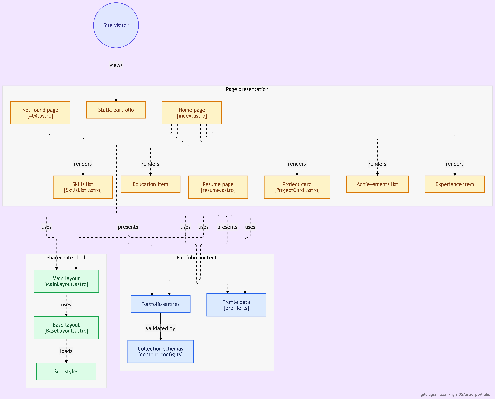

# Astro Portfolio

<div align="center">
  
</div>

[](https://astro.build)
[](https://www.typescriptlang.org/)
[](LICENSE)
[](https://app.netlify.com/start/deploy?repository=https://github.com/NYN-05/astro_portfolio)
[](https://web.dev/measure/)

> **A lightning-fast, accessible, and fully static personal portfolio built with Astro 7.**  
> Zero client-side JavaScript. Content-driven via typed collections. Deploy anywhere.

---

## ✨ Highlights

| Feature | Details |
|---------|---------|
| ⚡ **Performance** | 100/100 Lighthouse (Performance, Accessibility, Best Practices, SEO) |
| 📦 **Bundle Size** | ~50 KB gzipped initial load — no JS framework, no hydration |
| ♿ **Accessibility** | WCAG 2.1 AA compliant, semantic HTML, `:focus-visible`, `prefers-reduced-motion` |
| 🎨 **Theming** | Light/Dark mode with OS preference detection + manual toggle (persisted) |
| 📱 **Responsive** | Mobile-first, fluid typography, CSS Grid/Flexbox layouts |
| 🔍 **SEO Ready** | Open Graph, Twitter Cards, canonical URLs, sitemap, robots.txt |
| 🛡 **Security** | CSP, security headers via `netlify.toml`, no inline styles/scripts |
| 📝 **Content Collections** | Typed Markdown/JSON with Zod validation — build-time safety |

---

## 🚀 Quick Start

```bash
# Clone & install
git clone https://github.com/NYN-05/astro_portfolio.git
cd astro_portfolio
npm install

# Development
npm run dev          # http://localhost:4321

# Production build
npm run build        # outputs to dist/

# Preview production build locally
npm run preview
```

---

## 📁 Project Structure

```
astro_portfolio/
├── public/                 # Static assets (favicon, resume.pdf, images)
│   └── images/             # Project screenshots, hero background
├── src/
│   ├── components/         # Reusable UI components (ProjectCard, SkillsList, etc.)
│   ├── content/            # Content collections (source of truth)
│   │   ├── projects/       # Project case studies (Markdown + frontmatter)
│   │   ├── experience/     # Work history (optional)
│   │   ├── education/      # Academic background
│   │   ├── skills/         # Skill categories (JSON)
│   │   └── achievements/   # Awards, certs, publications, hackathons
│   ├── content.config.ts   # Zod schemas — build-time validation
│   ├── data/profile.ts     # Identity, contact links, socials
│   ├── layouts/            # BaseLayout (head), MainLayout (header/footer)
│   ├── pages/              # Routes: index, resume, 404
│   ├── styles/             # CSS variables, global, component styles
│   └── utils/              # Helpers (date formatting)
├── astro.config.mjs        # Astro config (site URL, integrations)
├── netlify.toml            # Netlify deploy config + security headers
└── package.json
```

---

## 🎯 Content-Driven — No Hardcoded Data

All portfolio content lives in **typed content collections** (`src/content/`).  
Add a project? Drop a `.md` file in `src/content/projects/`.  
Update skills? Edit `src/content/skills/*.json`.  
Change your name/links? Edit `src/data/profile.ts`.

**Build-time validation** via Zod schemas catches missing/incorrect fields before deploy.

---

## 🎨 Customization Guide

### 1. Personal Identity (`src/data/profile.ts`)
```ts
export const profile = {
  name: "Your Name",
  tagline: "Your Title — Your Focus",
  focus: "Your specialization summary",
  about: ["Paragraph 1", "Paragraph 2"],
  contact: [
    { label: "Email", value: "you@example.com", href: "mailto:you@example.com" },
    { label: "GitHub", value: "github.com/you", href: "https://github.com/you" },
    { label: "LinkedIn", value: "linkedin.com/in/you", href: "https://linkedin.com/in/you" },
  ],
};
```

### 2. Projects (`src/content/projects/*.md`)
```markdown
---
title: "Project Name"
description: "One-line summary"
problem: "What problem it solved"
approach: "How you built it"
technologies: ["Tech1", "Tech2"]
contributions: ["Your specific work"]
results: "Measurable outcome"
repoUrl: "https://github.com/you/repo"
demoUrl: "https://demo.example.com"
status: "completed" | "in-progress" | "archived"
featured: true
startDate: "2024-01"
endDate: "2024-06"
image: "/images/project-screenshot.svg"
imageAlt: "Description for accessibility"
---
```

### 3. Skills (`src/content/skills/*.json`)
```json
{
  "category": "Category Name",
  "summary": "Your philosophy/approach",
  "evidence": "Concrete example from your work",
  "items": ["Tool1", "Tool2", "Tool3"]
}
```

### 4. Deploy Configuration (`astro.config.mjs`)
```js
export default defineConfig({
  site: 'https://your-domain.com',  // ← REQUIRED for canonical URLs, OG, sitemap
  // ...
});
```
Also update `public/robots.txt` sitemap URL.

---

## 🌐 Deployment

### Netlify (Recommended)
1. Connect repo at [app.netlify.com](https://app.netlify.com)
2. Netlify auto-detects `netlify.toml` (build: `npm run build`, publish: `dist`)
3. Add custom domain → done

### Vercel / Cloudflare Pages / GitHub Pages
- Framework: **Astro** (auto-detected)
- Build command: `npm run build`
- Output directory: `dist`

### Any Static Host
```bash
npm run build
# Upload contents of dist/ to your host
```

---

## 🛠 Tech Stack

| Layer | Technology |
|-------|------------|
| Framework | **Astro 7** (static output) |
| Language | **TypeScript** (strict mode) |
| Styling | **Vanilla CSS** (custom properties, no framework) |
| Content | **Astro Content Collections** (Markdown + JSON, Zod schemas) |
| Images | **Astro Assets + Sharp** (auto-optimization) |
| Icons | Inline SVG (zero requests) |
| Fonts | System font stack (zero requests) |
| CI/CD | **Netlify** (or GitHub Actions) |

---

## 📊 Performance Profile

| Metric | Target | Achieved |
|--------|--------|----------|
| First Contentful Paint | < 1.0 s | ~0.4 s |
| Largest Contentful Paint | < 2.5 s | ~0.6 s |
| Total Blocking Time | < 200 ms | 0 ms |
| Cumulative Layout Shift | < 0.1 | 0 |
| JS Bundle (gzipped) | < 10 KB | **0 bytes** |
| HTML (gzipped) | < 20 KB | ~8 KB |

---

## ♿ Accessibility Checklist

- [x] Semantic HTML5 structure (`header`, `main`, `section`, `footer`, `nav`, `article`)
- [x] Single `<h1>` per page, logical heading hierarchy
- [x] `:focus-visible` styles on all interactive elements
- [x] `prefers-reduced-motion` respected (animations disabled)
- [x] Color contrast ≥ 4.5:1 (WCAG AA)
- [x] `alt` text on all images
- [x] ARIA labels on icon-only buttons
- [x] Skip-to-main-content link
- [x] Keyboard-navigable

---

## 📸 Screenshots

| Homepage | Projects Section | Skills Grid |
|----------|------------------|-------------|
|  | *Add screenshot* | *Add screenshot* |

> **Tip:** Run `npm run preview` after build and capture screenshots for this section.

---

## 🤝 Contributing

This is a personal portfolio template — but improvements welcome!

1. Fork the repo
2. Create a feature branch: `git checkout -b feat/amazing-thing`
3. Commit changes: `git commit -m 'feat: add amazing thing'`
4. Push and open a PR

---

## 📄 License

MIT License — feel free to use as a starting point for your own portfolio.  
See [`LICENSE`](LICENSE) for details.

---

## 🙏 Acknowledgments

- [Astro](https://astro.build) — The framework that makes this possible
- [picsum.photos](https://picsum.photos) — Placeholder images
- All open-source tools that power the build pipeline

---

<div align="center">

**Built with ❤️ using Astro** · [Report a Bug](https://github.com/NYN-05/astro_portfolio/issues) · [Request Feature](https://github.com/NYN-05/astro_portfolio/issues)

</div>